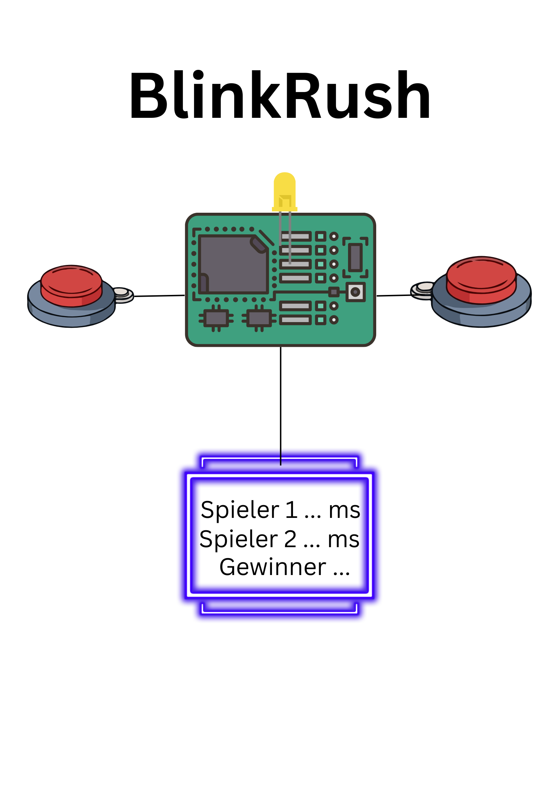

# Concept - `<BlinkRush>`
### Arneth, Fahradyan
> - Full problem description:
    Jeder Spieler hat einen Taster und eine LED.
    Die Taster geben das Startsignal, indem sie gleichzeitig aufleuchten.
    Nach einer zufälligen Wartezeit leuchten die Taster auf.
    Beide Spieler drücken so schnell wie möglich ihren Taster.
    Die LED des schnelleren Spielers blinkt als Zeichen für den Sieger.
> - Einteilung:
>   - Johanna: Software
>   - Arsen: Hardware/Software
> - Tasks & Milestones: 
>   1. Spielablauf schriftlich festgelegt
>   2. Grobes Design des Programms steht
>   3. Einfache Version des Spiels läuft (09.03.2026)
>   4. Startsignal, Zufallswartezeit (16.03.2026)
>   5. Gewinner wird richtig erkannt (23.03.2026)
>   6. Gewinner-LED blinkt (23.03.2026)
>   7. Reaktionszeit wird gemessen (13.04.2026)
>   - (Meilensteine kommen möglicherweise dazu)
>   - Projektende (spätestens):20.04.2026
>   8. Gewinner LED blinkt (27.04.2026)
>   9. Display Ausgabe (27.04.2026)
>   10. Bedienungsanleitung schreiben (11.05.2026)
> - Used Technolgies: 2 LED's, Oled Display, Raspberry Pico W
> - Mockup: 